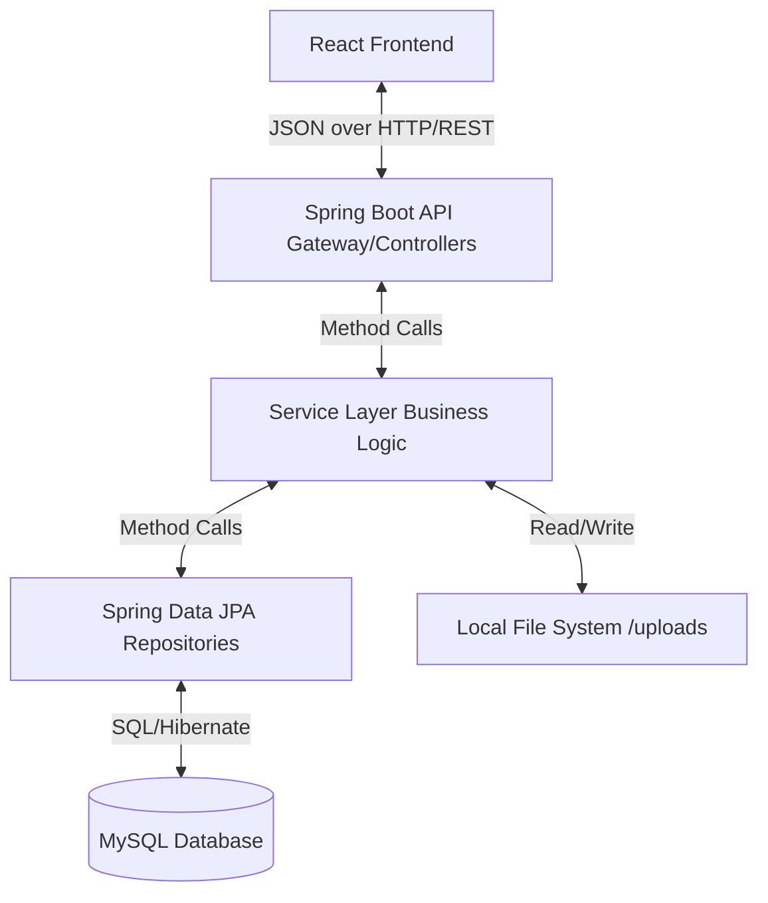

# TrackIT: System Architecture & Design Document

## 1. Executive Summary
TrackIT is a comprehensive, role-based Bug Tracking and Issue Management system built to facilitate efficient software development workflows. The application follows a modern **Client-Server Architecture**, featuring a decoupled **React.js** single-page application (SPA) on the frontend and a robust **Spring Boot** RESTful API on the backend. Data persistence is managed via **MySQL**, supplemented by local file storage for issue attachments.

## 2. High-Level Architecture
The system is divided into three primary tiers:
- **Presentation Layer (Frontend):** A React application that provides a dynamic, component-driven user interface.
- **Application Layer (Backend):** A Spring Boot monolith that encapsulates all business logic, security rules, and data processing.
- **Data Layer (Database & Storage):** A MySQL relational database for structured data, with an integrated file system utility for handling media uploads.

## 3. Backend Architecture & Component Interaction
The backend adheres strictly to the **N-Tier Architecture pattern**, ensuring a clean separation of concerns. This separation makes the codebase modular, testable, and highly maintainable.

### 3.1. Controller Layer (REST API)
- **Role:** Acts as the entry point for the React frontend.
- **Function:** Responsible for parsing incoming HTTP requests, validating JWT tokens via Spring Security filters, mapping JSON payloads to Data Transfer Objects (DTOs), and returning appropriate HTTP status codes (e.g., 200 OK, 201 Created).
- **Components:** `AuthController`, `IssueController`, `CommentController`, `DashboardController`.

### 3.2. Service Layer (Business Logic)
- **Role:** Contains the core intelligence and rules of the application.
- **Design Reasoning:** By separating business logic from Controllers, we make the system highly reusable. For instance, `IssueService` enforces state transition rules (e.g., verifying if a task is permitted to move from `IN_PROGRESS` to `RESOLVED` based on the user's role).
- **Component Interaction:** Services orchestrate interactions between multiple repositories. When `IssueService` processes a status update, it subsequently triggers the `NotificationService`.

### 3.3. Data Access Layer (Repositories)
- **Role:** Utilizes Spring Data JPA (Hibernate) to abstract SQL interactions.
- **Design Reasoning:** The Repository pattern prevents SQL injection and abstracts away complex database queries. It allows developers to interact with the database using pure Java objects (Entities) rather than raw SQL strings.

## 4. Frontend Architecture
The frontend is built using React.js and structured to be highly modular and responsive.

- **State Management (Context API):** Global state (Authentication sessions, Notifications, and Issue lists) is handled via React Context (`AuthContext`, `IssueContext`). This prevents "prop-drilling" and allows any component in the tree to instantly react to session changes.
- **Role-Aware Routing:** The UI dynamically renders different layouts based on the authenticated user's role. For example, the `Dashboard.jsx` component evaluates the JWT role and seamlessly renders either the `DeveloperDashboard` or `AdminDashboard`.
- **CSS Architecture:** A custom CSS variables-based theme (`index.css`) ensures a cohesive "Premium Academic Dashboard" aesthetic, enforcing strict design tokens across all components.

## 5. Security & Authentication
Security is a paramount design consideration, heavily integrated into the interaction flow.

- **Stateless JWT Authentication:** Upon login, the backend issues a cryptographically signed JSON Web Token (JWT). The frontend stores this token and attaches it as a `Bearer` token in the `Authorization` header of every subsequent Axios request. This makes the backend stateless and highly scalable.
- **Role-Based Access Control (RBAC):** Users are assigned one of three roles: `ADMIN`, `DEVELOPER`, or `REPORTER`. Method-level security (`@PreAuthorize`) in the Spring Controllers ensures that API endpoints are locked down. For example, only an Admin can delete a user, and a Developer cannot reassign issues they do not own.

## 6. Key Design Choices & Patterns

### 6.1. DTO (Data Transfer Object) Pattern
- **What:** Data sent to and from the API uses specific DTO classes (e.g., `IssueResponse`, `IssueCreateRequest`) rather than exposing direct database entities.
- **Why:** Prevents over-posting vulnerabilities, hides sensitive database fields (like password hashes or internal IDs), and decouples the API contract from the internal database schema. If the database schema changes, the API response format remains stable.

### 6.2. Observer Pattern Implementation
- **What:** The `NotificationService` acts as an observer for system events.
- **Why:** Instead of tangling notification logic deeply inside the `IssueService` or `CommentService`, those services simply broadcast state changes. The `NotificationService` independently catches these events and pushes real-time alerts to the relevant `DEVELOPER` or `REPORTER`.

### 6.3. Monolithic Backend Design
- **What:** The entire backend runs as a single deployed Spring Boot application.
- **Why:** For an issue tracking system of this scale, a monolith reduces operational complexity, avoids network latency between microservices, and makes maintaining transactional integrity (e.g., saving a comment and updating an issue's timestamp simultaneously) significantly easier.

### 6.4. File Storage Strategy
- **What:** Issue attachments are saved directly to a local `/uploads` directory via `FileStorageUtil`, storing only the filename in the database.
- **Why:** Storing binary files (BLOBs) directly in MySQL degrades database query performance and bloats backup sizes. Storing them on the filesystem is faster, cheaper, and more scalable.

## 7. Interaction Flow Example: Creating an Issue

To illustrate how the components interact, here is the lifecycle of a single request:

1. **Frontend Request:** A `REPORTER` fills out the `CreateIssue` form and attaches an error log file. React formats this into a `multipart/form-data` payload, attaches the JWT, and fires an Axios `POST` request.
2. **Security Gateway:** The Spring Security Filter Chain intercepts the request, validates the JWT signature, extracts the user ID, and verifies the user holds the `REPORTER` or `ADMIN` role.
3. **Controller Mapping:** `IssueController` receives the request, maps the incoming data to an `IssueCreateRequest` DTO, and delegates it to the `IssueService`.
4. **Service Execution:** `IssueService` uses `FileStorageUtil` to securely save the uploaded file to the filesystem, generating a sanitized filename. It then constructs a new `Issue` entity utilizing the Builder pattern.
5. **Database Persistence:** `IssueRepository` translates the entity state into a MySQL `INSERT` statement and saves the record.
6. **Event Trigger:** The `NotificationService` is invoked to generate an unread alert for System Admins that a new bug has been logged.
7. **Response Cycle:** A sanitized `IssueResponse` DTO is returned to the React frontend with a `201 Created` status, prompting the UI to automatically navigate the user to their newly created issue's detail page.
